# 📚 EasyNotes - PDF Color Inverter for Students

[Project Link](https://www.easynotes.space/)


## 🎯 Overview

**EasyNotes** is a powerful web application designed specifically for students who need to convert their colorful PDF notes into black and white format for cost-effective printing. The app intelligently inverts colors, making dark backgrounds light and ensuring text remains perfectly readable.

### 🌟 Why EasyNotes?

Students often face these challenges:
- **Expensive Color Printing**: Colored PDFs with dark backgrounds consume excessive ink
- **Poor Readability**: Dark backgrounds make printed notes hard to read
- **Wasted Resources**: Multiple files need individual processing
- **Complex Tools**: Existing solutions are complicated and expensive

**EasyNotes solves all these problems in 5 simple steps!**

---

## 🚀 Key Features

### ✨ Smart Color Inversion
- **True Pixel-Level Processing**: Inverts every pixel (RGB: 255 - original value)
- **Preserves Quality**: Maintains original PDF resolution and layout
- **Handles All Content**: Text, images, graphics, and complex layouts

### 📁 Flexible File Handling
- **Multiple PDFs**: Merge up to multiple files into one document
- **Large File Support**: Handle files up to 400MB on desktop, 150MB on mobile
- **Smart Validation**: Automatic file size and format checking

### 🎨 Advanced Processing
- **Page Selection**: Remove unwanted pages before final processing
- **Layout Options**: Choose pages per sheet and alignment
- **Preview Mode**: See before and after comparison

### 📱 Responsive Design
- **Mobile Optimized**: Works perfectly on phones and tablets
- **Desktop Ready**: Full feature set on larger screens
- **Progressive Loading**: Lazy-loaded components for better performance

---

## 🏗️ Application Architecture

### Technology Stack

```
Frontend Framework: React 18 + TypeScript
Build Tool: Vite
Styling: Tailwind CSS + shadcn/ui
PDF Processing: pdf-lib + pdf.js
State Management: React Hooks + Context
Routing: React Router DOM
Performance: Lazy Loading + Error Boundaries
```

### Project Structure

```
src/
├── components/
│   ├── PDFConverter.tsx          # Main application component
│   ├── steps/                    # Step-by-step process components
│   │   ├── StepOne.tsx          # File upload and merging
│   │   ├── StepTwo.tsx          # Color inversion processing
│   │   ├── StepThree.tsx        # Page selection and editing
│   │   ├── StepFour.tsx         # Layout configuration
│   │   ├── StepFive.tsx         # Download and completion
│   │   ├── components/          # Reusable step components
│   │   │   ├── FileUploadArea.tsx
│   │   │   ├── FileList.tsx
│   │   │   ├── SizeLimitsInfo.tsx
│   │   │   ├── MergeSection.tsx
│   │   │   └── ...
│   │   ├── hooks/               # Custom hooks
│   │   │   └── usePdfPreviews.ts
│   │   └── utils/               # Utility functions
│   │       └── fileValidation.ts
│   ├── ui/                      # shadcn/ui components
│   └── optimization/            # Performance components
├── pages/                       # Route components
└── lib/                        # Shared utilities
```

---

## 🔄 Data Flow & Process

### Step-by-Step Process Flow

```mermaid
graph TD
    A[📁 Upload PDFs] --> B{Single or Multiple?}
    B -->|Single| C[✅ Validate File]
    B -->|Multiple| D[🔗 Merge PDFs]
    C --> E[🎨 Color Inversion]
    D --> E
    E --> F[📋 Page Selection]
    F --> G[📐 Layout Setup]
    G --> H[💾 Download Ready]
```



### Detailed Data Flow

#### 1. **File Upload & Validation** (`StepOne`)
```typescript
interface PDFData {
  files: File[];           // Original uploaded files
  mergedPdf: File | null;  // Merged/processed single file
  // ... other properties
}
```

**Process:**
1. User drops/selects PDF files
2. Validate file types (only PDFs allowed)
3. Check file sizes (100MB per file, 400MB total on desktop)
4. Merge multiple files or prepare single file
5. Update application state

#### 2. **Color Inversion** (`StepTwo`)
```typescript
// True pixel-level inversion algorithm
for (let i = 0; i < imageData.length; i += 4) {
  data[i] = 255 - data[i];         // Red channel
  data[i + 1] = 255 - data[i + 1]; // Green channel  
  data[i + 2] = 255 - data[i + 2]; // Blue channel
  // Alpha channel unchanged
}
```

**Process:**
1. Load PDF using pdf.js library
2. Render each page to high-resolution canvas
3. Extract pixel data and invert RGB values
4. Rebuild PDF with inverted images using pdf-lib
5. Progress tracking and status updates

#### 3. **Page Management** (`StepThree`)
```typescript
interface PageSelection {
  selectedPages: number[];    // Pages marked for deletion
  totalPages: number;        // Original page count
  pagePreviewUrls: string[]; // Generated preview images
}
```

**Process:**
1. Generate thumbnail previews for all pages
2. Allow users to select unwanted pages
3. Update final page count and selection state

#### 4. **Layout Configuration** (`StepFour`)
```typescript
interface LayoutConfig {
  pagesPerSheet: number;           // 1, 2, 4, 6, 9, 16
  alignment: 'vertical' | 'horizontal';
  pageOrientation?: string;
}
```

#### 5. **Final Processing & Download** (`StepFive`)
1. Apply page deletions if any
2. Apply layout configuration
3. Generate final PDF file
4. Provide download link and sharing options

---

## 🎓 How EasyNotes Helps Students

### 💰 Cost Savings
- **Reduces Ink Usage by 80%**: Dark backgrounds become white
- **Cheaper Printing**: Black and white printing costs 5-10x less than color
- **Bulk Processing**: Handle multiple files at once

### 📖 Better Readability
- **High Contrast**: Dark text on light background is easier to read
- **Eye Strain Reduction**: Light backgrounds reduce eye fatigue during long study sessions
- **Print Quality**: Better contrast means clearer printed text

### ⏱️ Time Efficiency
- **Batch Processing**: Convert multiple PDFs simultaneously
- **One-Click Solution**: Simple 5-step process
- **No Software Installation**: Works directly in browser

### 📱 Accessibility
- **Works Anywhere**: Any device with a browser
- **Offline Processing**: Files processed locally (privacy-friendly)
- **Mobile Friendly**: Use on phone, tablet, or desktop

---

## 🛠️ Technical Implementation

### PDF Processing Pipeline

1. **File Reading**: Convert File objects to ArrayBuffer
2. **PDF Parsing**: Use pdf.js to parse PDF structure
3. **Canvas Rendering**: Render pages to HTML5 Canvas at high resolution
4. **Pixel Manipulation**: Direct pixel data manipulation for color inversion
5. **PDF Reconstruction**: Use pdf-lib to create new PDF with processed images

### Performance Optimizations

- **Lazy Loading**: Components loaded only when needed
- **Error Boundaries**: Graceful error handling and recovery
- **Memory Management**: Proper cleanup of large file objects
- **Progressive Processing**: Step-by-step processing with progress indicators

### Device Adaptations

```typescript
// Dynamic size limits based on device capability
const isMobile = window.innerWidth < 768;
const MAX_FILE_SIZE = isMobile ? 50 * 1024 * 1024 : 100 * 1024 * 1024;
const MAX_TOTAL_SIZE = isMobile ? 150 * 1024 * 1024 : 400 * 1024 * 1024;
```

---

## 🚀 Getting Started

### Prerequisites
- Node.js 16+ and npm
- Modern web browser with HTML5 Canvas support

### Installation

```bash
# Clone the repository
git clone <YOUR_GIT_URL>

# Navigate to project directory
cd easynotes

# Install dependencies
npm install

# Start development server
npm run dev
```

### Usage

1. **Upload**: Drop your PDF files or click to browse
2. **Convert**: Click to invert colors with real PDF processing
3. **Edit**: Remove unwanted pages if needed
4. **Layout**: Choose pages per sheet and alignment
5. **Download**: Get your print-ready PDF!

---

## 🔧 Configuration

### File Size Limits
- **Desktop**: 100MB per file, 400MB total
- **Mobile**: 50MB per file, 150MB total
- **Single Large File**: Up to total limit (400MB desktop, 150MB mobile)

### Supported Formats
- Input: PDF files only
- Output: PDF with inverted colors
- Quality: Original resolution maintained

---

## 🤝 Contributing

We welcome contributions! Here's how you can help:

1. **Bug Reports**: Use GitHub issues to report bugs
2. **Feature Requests**: Suggest new features via issues
3. **Code Contributions**: Fork, create feature branch, and submit PR
4. **Documentation**: Help improve this README and code comments

### Development Guidelines

- Follow TypeScript best practices
- Use Tailwind CSS for styling
- Write focused, small components
- Add proper error handling
- Include console logs for debugging

---

## 📄 License

This project is licensed under the MIT License - see the LICENSE file for details.

---

## 🙏 Acknowledgments

- **pdf.js**: Mozilla's PDF parsing library
- **pdf-lib**: PDF creation and manipulation
- **shadcn/ui**: Beautiful and accessible UI components
- **Tailwind CSS**: Utility-first CSS framework
- **React**: UI library for building user interfaces

---

## 📞 Support

Having issues? We're here to help!

- **Documentation**: Check this README first
- **Issues**: Create a GitHub issue for bugs
- **Community**: Join our Discord community
- **Email**: Contact us at support@easynotes.app

---

## 🎯 Roadmap

### Upcoming Features
- [ ] Batch processing for 50+ files
- [ ] Advanced color filters (sepia, grayscale options)
- [ ] Cloud storage integration
- [ ] Mobile app versions
- [ ] OCR text extraction and editing
- [ ] Watermark removal tools

### Version History
- **v1.0.0**: Initial release with core functionality
- **v1.1.0**: Added mobile optimization and larger file support
- **v1.2.0**: Improved UI/UX and performance optimizations

---

<div align="center">

**Made with ❤️ for students worldwide**

*Converting your colorful notes into print-friendly PDFs, one click at a time.*

[](https://easynotes.lovable.app)
[]()
[](LICENSE)

</div>
